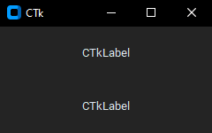

_[Abies](https://en.wikipedia.org/wiki/Fir) balsamea is evergreen species._


**abies** is a simple layout builder for CustomTkinter,
using JSON files you can make layouts with ease.

## Usage

### JSON

```json
{
  "Label": {
    "pack": {
      "anchor": "center",
      "expand": true
    }
  },
  "Label.": {
    "pack": {
      "anchor": "center",
      "expand": true
    }
  }
}
```

### Python

`abies(master).load(layout)`


